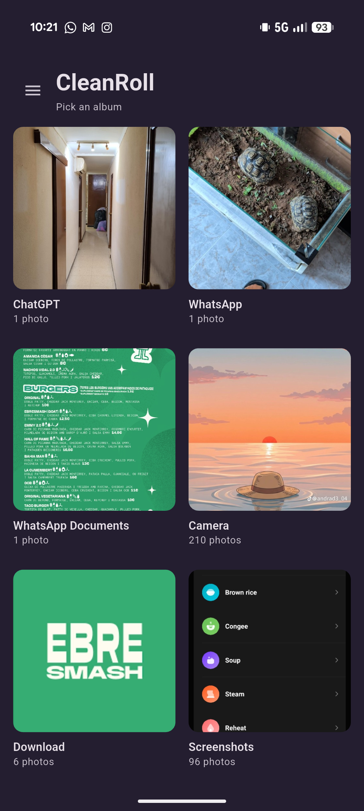
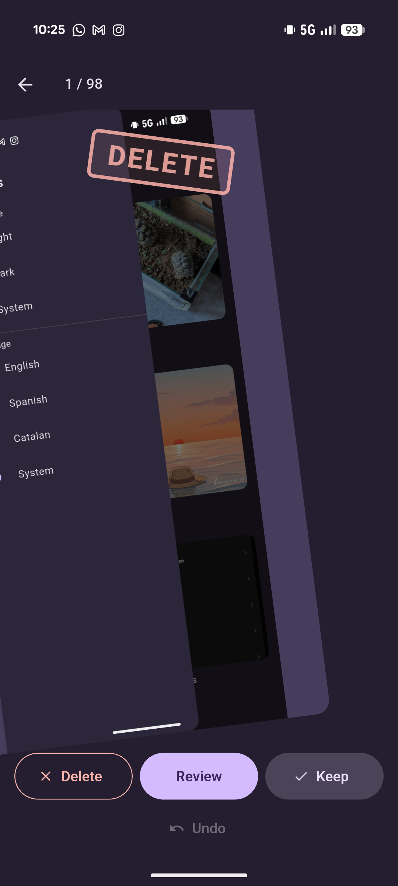
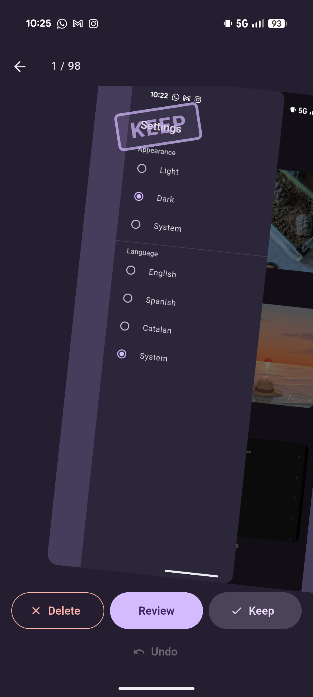
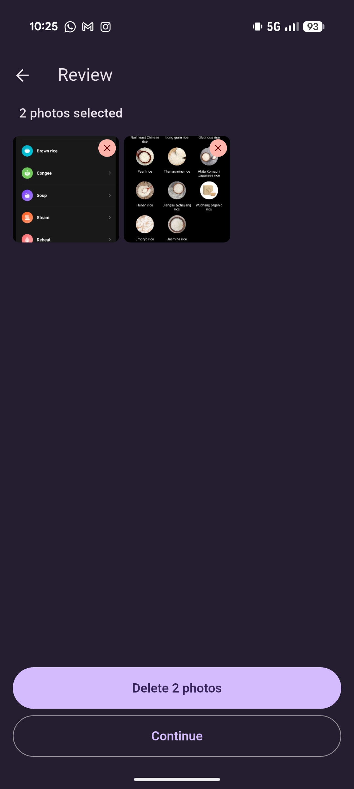
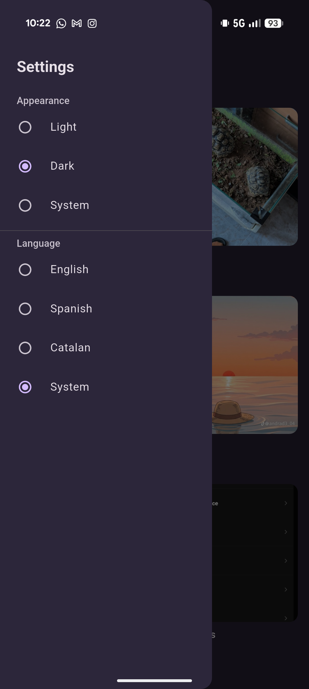

# CleanRoll


CleanRoll is a local-only photo cleaner for Android and iOS. Pick an album, choose an order, swipe Keep or Delete, open Review at any time, then confirm deletion.

The project is built with Flutter and Dart, Material 3, `photo_manager`, and `shared_preferences`. It is intentionally single-user and offline: photos never leave the device, and there is no account, backend, or analytics.

Swiping Delete only **marks** a photo. The photo library changes only after Review, when the user taps Delete and completes the **platform** confirmation dialog.

## Download and update

Download the latest Android APK from [GitHub Releases](https://github.com/roypm/cleanroll/releases/latest).

File name pattern: `CleanRoll-vX.Y.Z.apk`.

CleanRoll does not install updates automatically. There is nothing to export before updating: the cleaning session lives in memory, and photos stay in the library until a confirmed deletion finishes. Theme and language are the only preferences stored on the device.

Release APKs are signed with the debug keystore. If Android rejects the new APK because its signing key does not match the installed app, uninstall the old version and install the new APK. Uninstalling the app does not delete photos.

iOS builds from the same codebase. Published downloads are Android APKs only.

## Status

Personal Flutter project focused on a small, safe photo-cleaning loop. The app is functional and Android builds are distributed through GitHub Releases.

## Screenshots

Screenshots use the dark theme.

<table>
  <tr>
    <th>Albums</th>
    <th>Mark for deletion</th>
    <th>Keep</th>
  </tr>
  <tr>
    <td></td>
    <td></td>
    <td></td>
  </tr>
</table>

<table>
  <tr>
    <th>Review</th>
    <th>Settings</th>
  </tr>
  <tr>
    <td></td>
    <td></td>
  </tr>
</table>

## Features

- Pick one album from a cover grid. The app does not create, rename, or move albums.
- Review that album newest first, oldest first, or in a one-time random shuffle.
- Swipe or tap to Keep a photo, or to mark it for deletion.
- Undo the last five Keep / Delete decisions.
- Open Review at any time, including before the album is finished, so a large album never traps the session.
- Deselect photos in a three-column grid and preview a thumbnail full screen.
- Continue cleaning from the same photo, or delete only the current selection.
- Delete through the system photo-library dialog. There is no second in-app confirmation.
- If the system dialog is cancelled, stay on Review and keep the selection.
- Report full success, partial failure, and failure in plain language.
- Work with granted or limited photo access. Limited access only sees the photos the user allowed.
- Switch between system, light, and dark themes.
- Use Spanish, English, Catalan, or the system language.

## Engineering Highlights

- In-memory cleaning session. Keep, mark, undo, and deselect never call the platform delete API.
- Two-phase deletion: selection during cleaning, then a confirmed platform delete from Review.
- Empty platform delete results are treated as cancellation, not failure.
- Newest and oldest sessions open after the first page of photos. Later pages load in the background.
- Random order loads the album once and shuffles it before the first photo.
- Thumbnail bytes stay in memory, and the cleaning screen prefetches the next and previous photo.
- `ChangeNotifier` controllers for the session and for settings. No database for cleaning decisions.
- CI runs the analyzer and unit tests. Merges to `main` publish a versioned release APK.

## Privacy

CleanRoll stores nothing in the cloud. Cleaning decisions exist only while the app is open. Theme and language are saved on the device with `shared_preferences`. The core flow does not require accounts, servers, analytics, or network access.

## Tech Stack

- Flutter
- Dart
- Material 3
- photo_manager
- shared_preferences
- flutter_localizations / intl
- flutter_test

## Build

Requirements:

- Flutter stable (Dart 3.13 or newer)
- Android SDK to build an APK
- A Mac with Xcode to build or run on iOS
- Photo library permission on a device or emulator

Run the app:

```bash
flutter pub get
flutter run
```

Build a release APK:

```bash
flutter build apk --release
```

APK output:

- `build/app/outputs/flutter-apk/app-release.apk`

Release builds use the debug signing config in `android/app/build.gradle.kts`, so the project can be cloned and built without a private keystore.

## GitHub Actions

Two workflows:

| Workflow | When it runs | What it does |
|----------|----------------|--------------|
| [CI](.github/workflows/ci.yml) | Push to `main` or `develop`, and pull requests into `main` | `flutter analyze` and `flutter test` |
| [Release](.github/workflows/release.yml) | Push to `main`, unless the commit message starts with `chore: release` | Bumps the patch version in `pubspec.yaml`, runs analyze and test, builds a release APK, commits the bump, tags `vX.Y.Z`, and publishes a GitHub Release |

The release asset is named `CleanRoll-vX.Y.Z.apk`.

## Release flow

Day-to-day work stays on `develop`. `main` is the stable branch that publishes Android builds.

1. Commit on `develop`.
2. Open a pull request from `develop` into `main`.
3. CI runs `flutter analyze` and `flutter test`.
4. After the merge, the Release workflow bumps the patch number, builds the APK, and publishes the release.

The version lives in `pubspec.yaml` as `version: X.Y.Z+BUILD`. Each automatic release increments both the patch version and the build number. The workflow commits that change as `chore: release vX.Y.Z` and pushes the tag. That commit does not start another release.

## Tests

```bash
flutter test
flutter analyze
```

Unit tests cover the cleaning session, deletion outcomes, settings persistence, and the thumbnail cache. Permission prompts and real photo deletion still need a device.

## Architecture

CleanRoll keeps a small split between UI, session logic, and the photo library:

```text
UI (screens and widgets)
    <-> ChangeNotifier
CleaningController / SettingsController
    <->
PhotoService (photo_manager)
    <->
Platform photo library
```

`CleaningController` holds the album, order, current index, kept set, deletion set, and an undo stack of at most five decisions. `PhotoService` lists albums, loads photos, serves thumbnails, and deletes assets. Widgets do not call platform photo APIs directly.

Session state is not written to disk. If the app is closed before the platform deletion succeeds, the library is unchanged.

Product behavior: [docs/product.md](docs/product.md)

Screens and interactions: [docs/ux.md](docs/ux.md)

Implementation rules: [docs/technical.md](docs/technical.md)

Current phase: [docs/roadmap.md](docs/roadmap.md)
